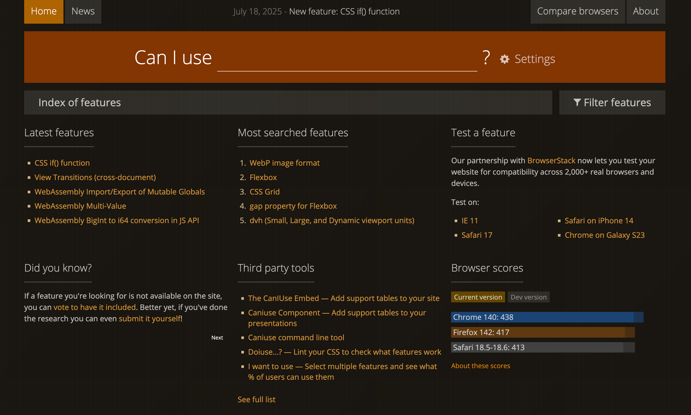
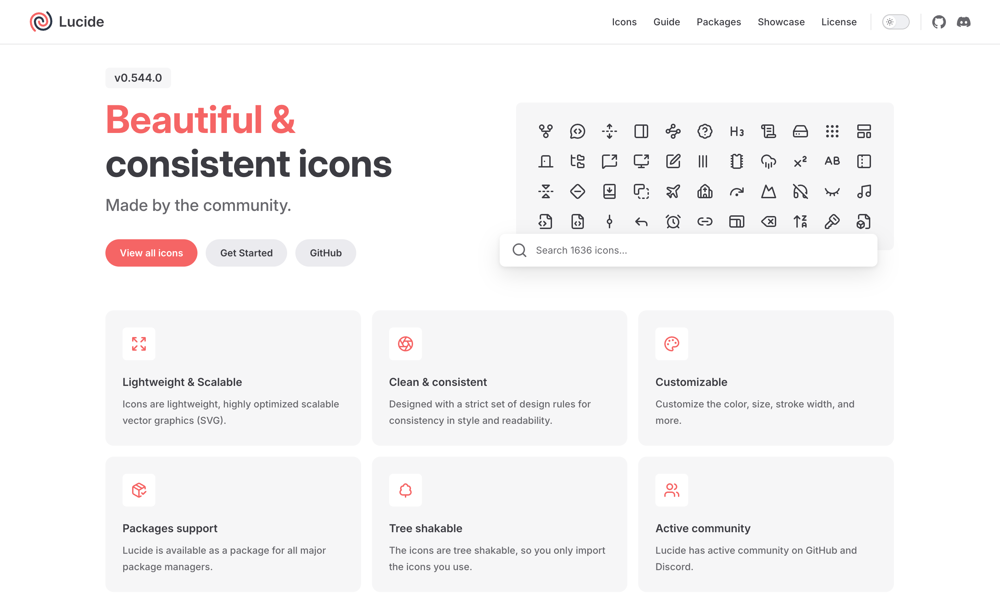
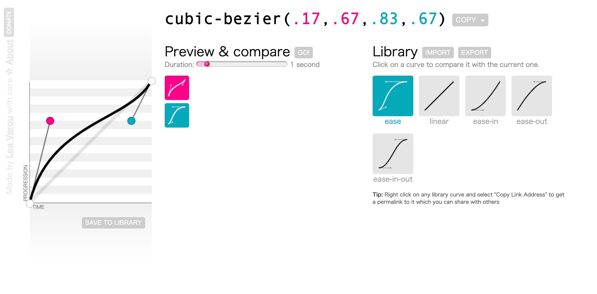
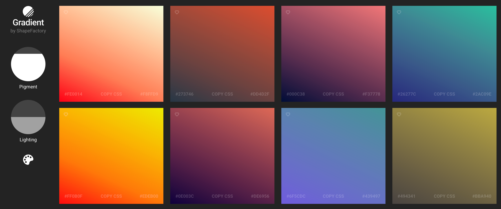
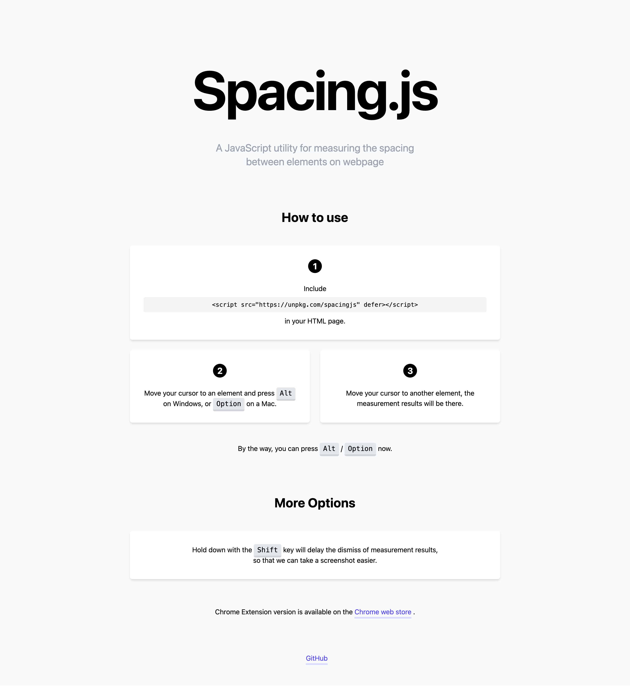
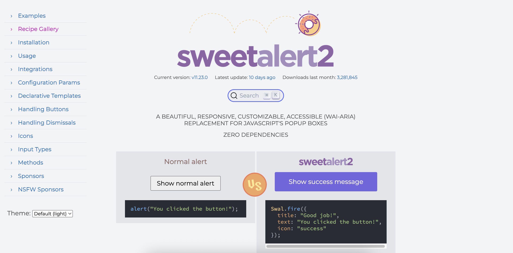

# 高效生产力

> 推荐我使用过的提高工作效率的工具、软件、网站和开源库等

## 一、网站

### 1. Can I use - 查询前端特性在浏览器上的支持情况

[官网地址](https://caniuse.com/)

### 2. Lucide - 精美的图标

[官网地址](https://lucide.dev/)

### 3. Cubic Bezier - 贝塞尔曲线

[官网地址](https://cubic-bezier.com/)

### 4. Gradient by Shapefactory - 渐变色

[官网地址](https://gradient.shapefactory.co/)

### 5. TinyPNG - 图片压缩

[官网地址](https://tinypng.com/)

## 二、工具

### 1. Spacing.js - 元素尺寸间距测量

[官网地址](http://spacingjs.com/)

### 2. Cleave.js - 输入框格式化

[官网地址](https://nosir.github.io/cleave.js/)

### 3. SweetAlert2 - 精美弹出框

[官网地址](https://sweetalert2.github.io/)

