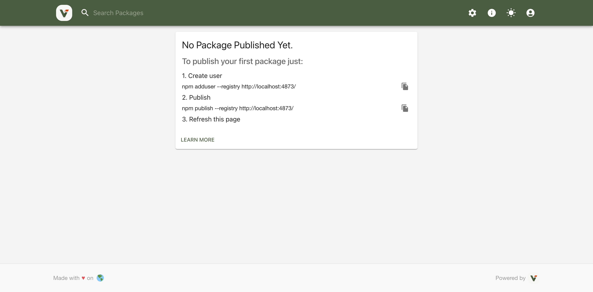

# Verdaccio 介绍与使用说明

> 适用于前端/Node.js 团队在**局域网或离线环境**快速搭建**私有 npm 仓库**。

## 1. 什么是 Verdaccio

Verdaccio 是一个**基于 Node.js 开发的轻量级私有 npm 代理仓库（proxy registry）**。

**核心定位**

1. 本地缓存：第一次安装后将包落盘，后续完全走内网，**提速 & 节省公网流量**。
2. 私有发布：把业务组件、工具库发布到内部仓库，**代码 0 外泄**。
3. 代理上游：可配置官方 npm、CNPM、公司级 Nexus 等任意上游，**按需同步**。
4. 零配置：无需数据库，一条命令即可启动；支持 Docker / K8s 一键部署。

> OWASP 将「使用私有仓库」列为 NPM 安全最佳实践之一，Verdaccio 是开源领域最主流的实现方案。

## 2. 核心概念与工作原理

| 术语        | 说明                                                                         |
| ----------- | ---------------------------------------------------------------------------- |
| **Uplink**  | 上游仓库地址（默认 https://registry.npmjs.org）。本地找不到包时自动代理。    |
| **Storage** | 本地落盘目录（默认 `~/.config/verdaccio/storage`），缓存及私有包均存放于此。 |
| **Plugin**  | 认证（htpasswd、ldap）、存储（local/minio）、中间件等均可插拔。              |
| **Auth**    | 基于 `htpasswd` 文件或外部系统（GitLab、LDAP）做登录/权限校验。              |

**工作流程**

`npm install lodash`

1. 客户端请求发向 Verdaccio。
2. Verdaccio 先查本地存储 → 有则直接返回（**秒装**）。
3. 无则向上游拉取 → 本地缓存 → 同时返回给客户端（**下次离线也可用**）。

## 3. 安装与启动

### 3.1 NPM 全局安装（开发机最常用）

```bash
# 1) 安装
npm i -g verdaccio
# 或 yarn global add verdaccio

# 2) 启动（前台）
verdaccio
# 默认 http://localhost:4873
# 配置目录：~/.config/verdaccio/config.yaml
# 数据目录：~/.config/verdaccio/storage
```

### 3.2 PM2 守护（生产/长期运行）

```bash
npm i -g pm2
pm2 start verdaccio --name verdaccio
pm2 save                      # 加入开机自启
pm2 logs verdaccio            # 查看日志
```

> 这里使用 `pm2 start verdaccio` 只是托管成功

```bash
pm2 list              # 状态 online  
pm2 logs verdaccio    # 无报错  
curl localhost:4873   # 返回 Verdaccio 标题  
```

> 以上三步都通过，才算真正启动成功，否则

1. 先删错任务

```bash
pm2 delete verdaccio
```

2. 直接给「真实可执行文件」

```bash
# 找到 verdaccio 命令的真实路径
which verdaccio
# 典型输出 /Users/[NAME]/.nvm/versions/node/v18.20.4/bin/verdaccio
pm2 start /Users/[NAME]/.nvm/versions/node/v18.20.4/bin/verdaccio --name verdaccio
```

3. 验证

```bash
pm2 list                # status = online
pm2 logs verdaccio --lines 20   # 末尾出现
# http --- http://0.0.0.0:4873/ - verdaccio/5.x.x
curl -s http://localhost:4873 | grep -i title
# 返回 <title>Verdaccio</title>
```

浏览器打开 http://localhost:4873 能看到如下欢迎页即成功。




## 4. 客户端配置

**全局切换（所有项目生效）**

```bash
npm set registry http://localhost:4873
# 恢复官方
npm set registry https://registry.npmjs.org
```

**仅当前项目生效**

```bash
echo "registry=http://localhost:4873" >> .npmrc
```

## 5. 发布私有包

1. 创建用户

```bash
npm adduser --registry http://localhost:4873
```

2. 登录

```bash
npm login --registry http://localhost:4873
```

3. 在项目根执行

```bash
npm publish --registry http://localhost:4873
```

4. 安装私有包

```bash
npm install @your-scope/pkg --registry http://localhost:4873
```


## 6. 必改配置项速查

`~/.config/verdaccio/config.yaml` 

**关键字段**

```yaml
# 允许局域网访问
listen: 0.0.0.0:4873

# 上游加速（国内常用淘宝源）
uplinks:
  npmjs:
    url: https://registry.npmmirror.com/

# 权限：所有人可下载，仅登录用户可发布
packages:
  '@*/*':
    access: $all
    publish: $authenticated
  '**':
    access: $all
    publish: $authenticated

# 关闭用户注册（可选）
auth:
  htpasswd:
    file: ./htpasswd
    # max_users: 1000   # 注释掉即禁止注册新用户
```

修改后 `pm2 restart verdaccio` 生效。

## 7. 高阶玩法

| 场景             | 方案                                                             |
| -------------- | -------------------------------------------------------------- |
| **多 upstream** | 同时配置官方 + 公司 Nexus，按包范围自动路由                                     |
| **LDAP 登录**    | 安装 `verdaccio-ldap` 插件，对接企业 AD                                 |
| **WebHook**    | 结合 `verdaccio-audit` + `npm-audit` 实现安全扫描                      |
| **CI 自动发布**    | 在 GitLab CI / GitHub Actions 里 `npm publish --registry <内网地址>` |
| **离线厂房**       | 先在联网机 `npm install` 全量缓存，再整体拷贝 storage 目录到隔离环境                 |

## 8. 常见问题速解

| 现象       | 解决                                                           |
| -------- | ------------------------------------------------------------ |
| 端口占用     | `lsof -i :4873` 找到 PID 后 `kill -9`；或改 `listen: 0.0.0.0:4874` |
| 无法发布 403 | 确认 `publish` 权限为 `$authenticated` 且已 `npm login`             |
| 大包上传 413 | 在 config 里增加 `max_body_size: 50mb`                           |
| pm2 启动失败 | 用真实路径：<br>`pm2 start /usr/local/bin/verdaccio --name v`      |
| 浏览器空白    | 确认 `listen` 包含 `0.0.0.0`，并检查防火墙                              |

## 9. 总结
- **零成本：** 一条命令即可拥有私有 npm 源。
- **提效：** 缓存 + 局域网，安装速度提升 3~10 倍。
- **安全：** 代码不出内网，权限粒度可控。
- **生态全：** 与 npm / yarn / pnpm 100% 兼容，插件丰富，Docker/K8s 友好。

把 Verdaccio 接入研发流程后，团队即可像使用官方源一样发布、共享和维护内部模块，实现真正的「谁开发、谁发布、谁维护」的闭环。